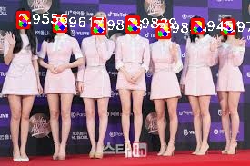

# RetinaFace in PyTorch

paper : https://arxiv.org/abs/1905.00641

> review : https://khyeyoon.github.io/face%20detection%20paper/RetinaFace/

* This code was written by modifying the code in the link below

> https://github.com/biubug6/Pytorch_Retinaface 

# Requirements

* Python3
* PyTorch >= 1.1.0
* Torchvision >= 0.3.0
* NVIDIA GPU + CUDA

# Train

Use it by modifying it appropriately for your path

  ```Shell
  CUDA_VISIBLE_DEVICES=0,1,2,3 python train.py --network resnet50 or
  CUDA_VISIBLE_DEVICES=0 python train.py --network mobile0.25
  ```

# Evaluation

Use it by modifying it appropriately for your path

* single image

```Shell
python evaluation-singleimg.py --trained_model weight_file --network mobile0.25 or resnet50
```

* multiple image

```Shell
evaluation-multipleimg.py --trained_model weight_file --network mobile0.25 or resnet50
```

# result 

<p align="center"></p>

